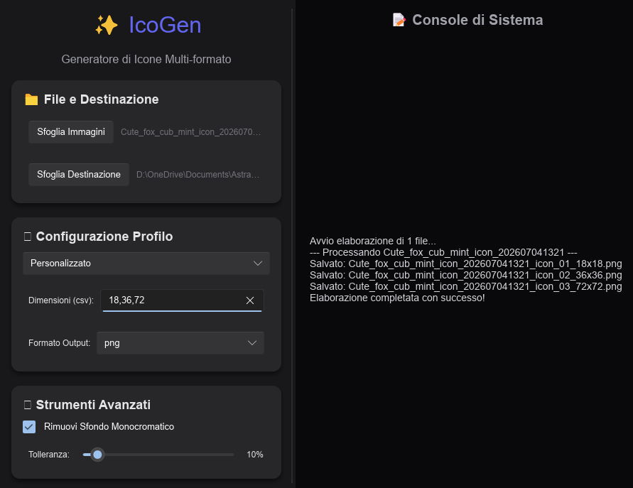

# ✨ IcoGen Premium

[](https://www.buymeacoffee.com/MichelBernasconi)

## About
**IcoGen** è un potentissimo generatore di icone multi-formato scritto interamente in **Rust** e potenziato da un'interfaccia grafica moderna, veloce e fluida basata su **Slint**. 

Questo tool è stato pensato appositamente per sviluppatori software, creatori di app mobile (Android/iOS) e web designer. Permette di prendere una singola immagine sorgente (oppure centinaia di immagini in batch) e generare in un solo clic tutte le dimensioni necessarie per i diversi ecosistemi, applicando automaticamente filtri di alta qualità (Lanczos3) ed, eventualmente, rimuovendo gli sfondi monocromatici indesiderati.



## 🚀 Caratteristiche Principali

- **Elaborazione Asincrona in Batch:** Non limitarti a un'icona alla volta. Seleziona un'intera cartella di immagini e IcoGen sfrutterà i thread di Rust in background per processarle tutte contemporaneamente, senza mai bloccare o rallentare l'interfaccia utente.
- **Rimozione Sfondo Intelligente (Chroma Key):** Quante volte ti capita di avere un logo in `.jpg` con un fastidioso quadrato bianco dietro? Attivando lo strumento "Rimuovi Sfondo Monocromatico", IcoGen individuerà il colore di sfondo principale e lo renderà trasparente (creando un vero e proprio canale Alpha). Grazie allo *slider di tolleranza*, puoi eliminare facilmente anche le fastidiose sfocature dovute alla compressione JPEG!
- **Interfaccia Nativa Slint:** Nessuna pesantezza tipica delle app Electron. L'interfaccia si avvia in un lampo, consuma pochissima RAM e offre un design "Premium" (ombreggiature dinamiche, angoli arrotondati, terminale integrato).

## 📱 Profili di Esportazione Inclusi

Invece di farti inserire manualmente dozzine di dimensioni diverse, IcoGen integra nativamente i profili per i sistemi operativi più famosi:

- **Android (`36x36`, `48x48`, `72x72`, `96x96`, `144x144`, `192x192`):** 
  Genera automaticamente tutte le densità di pixel richieste dall'ecosistema Android (`ldpi`, `mdpi`, `hdpi`, `xhdpi`, `xxhdpi`, `xxxhdpi`) necessarie per la `ic_launcher` o per la pubblicazione sul Google Play Store.
  
- **iOS / Apple (`20x20`, `29x29`, `40x40`, `58x58`, `60x60`, `76x76`, `80x80`, `87x87`, `114x114`, `120x120`, `152x152`, `167x167`, `180x180`, `1024x1024`):**
  L'ecosistema Apple è notoriamente molto esigente in fatto di asset grafici. Questo profilo genera tutte le innumerevoli risoluzioni `@1x`, `@2x` e `@3x` necessarie per la ricerca Spotlight, le Impostazioni, le icone dell'app su iPhone/iPad e la super-risoluzione necessaria per l'App Store Connect.

- **Favicon per il Web (`16x16`, `32x32`, `48x48`, `192x192`, `512x512`):**
  Perfetto per lo sviluppo Web. Crea le micro-icone necessarie per la barra delle schede dei browser desktop (`16px` e `32px`), assieme alle dimensioni più grandi richieste dalle PWA (Progressive Web Apps) per consentire agli utenti di salvare il tuo sito web sulla home screen dei loro smartphone Android/iOS.

- **Personalizzato:** 
  Hai bisogno di formati specifici (es. per un videogioco)? Scegli il profilo personalizzato, inserisci una lista di dimensioni separate da virgola (es: `24, 64, 256`) e IcoGen farà esattamente ciò che chiedi.

## Come iniziare

### Requisiti
- [Rust](https://www.rust-lang.org/tools/install) (Cargo) installato sul sistema.

### Avvio Rapido
```bash
git clone https://github.com/MichelBernasconi/IcoGen.git
cd IcoGen
cargo run --release
```

## Licenza
Distribuito con licenza MIT. Vedi `LICENSE` per maggiori informazioni.
